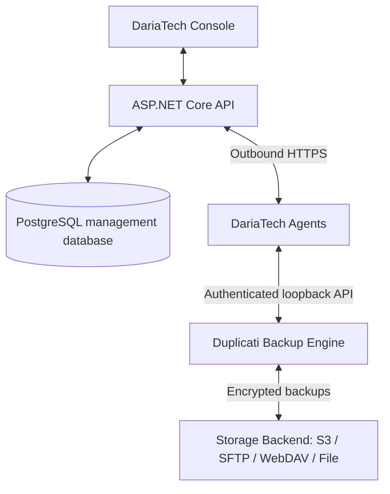

# Architecture

DariaTech modules live under `DariaTech/`, outside the upstream core. Console/API is a modular ASP.NET Core application with PostgreSQL; a separate .NET worker talks to an authenticated loopback Duplicati server. Razor Pages and small self-hosted CSS/JS keep the management UI independent from upstream Angular. Cookie sessions use CSRF-protected forms; agent routes use per-device credentials and narrowly typed inputs. No external analytics or CDNs.

One customer is one tenant. DariaTech operator users may have global roles; customer users are permanently scoped to a tenant. Sites, devices, jobs, runs, alerts and enrollment tokens carry tenant IDs; composite foreign keys prohibit cross-customer relationships. Tenant scope is derived from the authenticated principal, never trusted from a device request. Management users are not agent identities. Database and key persistence are separate from local engine databases.

A heartbeat proves connectivity only. Healthy requires recent successful backups and no active critical alerts. Unknown/no backup must be shown distinctly. Status payloads carry numeric counts, timestamps, version, operation status and error codes; destinations, sources, encryption keys and raw logs stay on device.

Remote restore/configuration/update phases must fail closed until implemented. Do not wrap arbitrary engine endpoints in a remote proxy. Keep vendor namespaces and storage formats unchanged to allow upstream merges.
